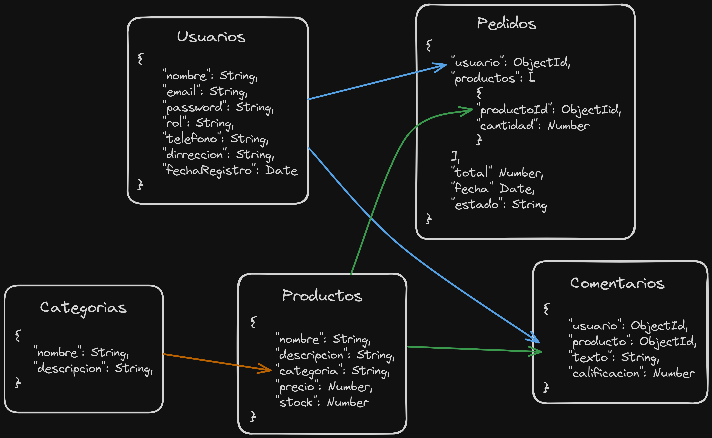

# Proyecto Prueba-PreFiltro

Este proyecto es una Aplicación Web desarrollada con el Stack MERN (Mongo, Express, React, Node) que permite realizar operaciones CRUD (Create, Read, Update, Delete) en varias entidades, incluyendo Categorías, Comentarios, Pedidos, Productos y Usuarios. Puedes interactuar con la aplicación tanto a través de la API como mediante el frontend que consume dicha API.

## Explicación del Proyecto

El proyecto se organiza de la siguiente manera:

1. [Requisitos Previos](#requisitos-previos): Los requisitos necesarios antes de ejecutar el proyecto.
2. [Documentación Swagger](#documentación-swagger): Acceso a la documentación de la API.
3. [Características](#características): Las principales características y funcionalidades del proyecto.
4. [Backend](#backend): Instrucciones para configurar y ejecutar el backend.
5. [Frontend](#frontend): Instrucciones para configurar y ejecutar el frontend.

## Requisitos Previos

Antes de comenzar, asegúrate de tener instalados los siguientes requisitos previos:

- [Node.js](https://nodejs.org/es)
- Clona el repositorio del proyecto desde GitHub:

```bash
git clone https://github.com/Akio1102/prueba-prefiltro.git
```

### Para la Ejecucción del Proyecto

Siga estos pasos para ejecutar el proyecto:

#### Backend

1. Dirígete a la carpeta [backend](./backend/) y ejecuta el siguiente comando para instalar las dependencias y ejecutar la API:

```bash
cd backend
npm i && npm run dev
```

#### FrontEnd

2. Dirígete a la carpeta [frontend](./frontend/) y ejecuta el siguiente comando para desplegar la página en el navegador:

```bash
cd frontend
npm i && npm start
```

## Documentacion Swagger

Puedes acceder a la documentación Swagger de la API en la siguiente URL:

[Documentación Swagger](http://localhost:9516/api-docs/)

Si se cambia las variables de entorno la URL es la siguiente:

```bash
http://localhost:9516/api-docs/
```

## Características

### Diagrama de Base de Datos NoSQL



| Collections | Create | Read | Update | Delete |
| ----------- | ------ | ---- | ------ | ------ |
| Productos   | ✅     | ✅   |        | ✅     |
| Categorias  | ✅     | ✅   |        | ✅     |
| Comentarios | ✅     | ✅   |        | ✅     |
| Pedidos     | ✅     | ✅   |        | ✅     |
| Usuarios    | ✅     | ✅   |        | ✅     |

## Backend

**Express.js**: Un marco de desarrollo web de Node.js que se utiliza para crear el backend de la API y manejar las solicitudes y respuestas HTTP.

### Dependencias

- [**cors**](https://www.npmjs.com/package/cors) Un middleware que permite la configuración de cabeceras HTTP para controlar el acceso a recursos de origen cruzado (CORS) en una API, lo que permite que diferentes dominios se comuniquen entre sí de manera segura.

- [**dotenv**](https://www.npmjs.com/package/dotenv) Una biblioteca que permite cargar variables de entorno desde un archivo .env, lo que facilita la configuración y gestión de variables sensibles y específicas del entorno.

- [**express**](https://www.npmjs.com/package/express) Un marco de desarrollo web de Node.js que simplifica la creación de aplicaciones web y APIs mediante la gestión de rutas, middleware y manejo de solicitudes y respuestas HTTP.

- [**mongodb**](https://www.npmjs.com/package/mongodb) Una librería de modelado de objetos de MongoDB para Node.js que facilita la interacción con la base de datos MongoDB, permitiendo definir modelos de datos y realizar operaciones de base de datos de manera más sencilla.

- [**morgan**](https://www.npmjs.com/package/morgan) Un middleware que registra los detalles de las solicitudes HTTP entrantes, lo que es útil para el registro y el análisis de eventos y comportamientos de la aplicación.

- [**swagger-ui-express**](https://www.npmjs.com/package/swagger-ui-express) Una biblioteca que facilita la documentación y visualización de la API.

### Dependencia de desarrollo

- [**nodemon**](https://www.npmjs.com/package/nodemon) Una herramienta de desarrollo que se utiliza para reiniciar automáticamente el servidor cada vez que se detectan cambios en los archivos del proyecto, lo que agiliza el proceso de desarrollo y prueba. Es una dependencia de desarrollo, lo que significa que no se utiliza en producción, sino solo durante el proceso de desarrollo.

## Frontend

**React.js**: Una biblioteca de JavaScript para construir interfaces de usuario interactivas y receptivas en el frontend del proyecto.

### Dependencias

- [**axios**](https://www.npmjs.com/package/axios) Una librería de JavaScript que permite realizar peticiones HTTP desde el cliente, lo que facilita la comunicación con servidores y APIs externas.

- [**react**](https://www.npmjs.com/package/react) Una biblioteca de JavaScript para construir interfaces de usuario interactivas y reactivas en aplicaciones web.

- [**react-dom**](https://www.npmjs.com/package/react-dom) Un paquete de React que proporciona métodos específicos para manipular el DOM del navegador, lo que permite renderizar componentes React en el navegador.

- [**react-query**]()

- [**react-router-dom**](https://www.npmjs.com/package/react-router-dom) Una librería de React que permite manejar la navegación y el enrutamiento de páginas en aplicaciones web de una sola página (SPA), lo que permite cargar y mostrar diferentes componentes según la URL.

- [**react-toastify**](https://www.npmjs.com/package/react-toastify)Una librería para mostrar notificaciones en la aplicación.

- [**rippleui**](https://www.npmjs.com/package/rippleui)

### Dependencias de desarrollo

- [**tailwindcss**](https://www.npmjs.com/package/tailwindcss) Un framework de CSS que proporciona una amplia colección de clases utilitarias para estilizar rápidamente componentes y páginas web.
